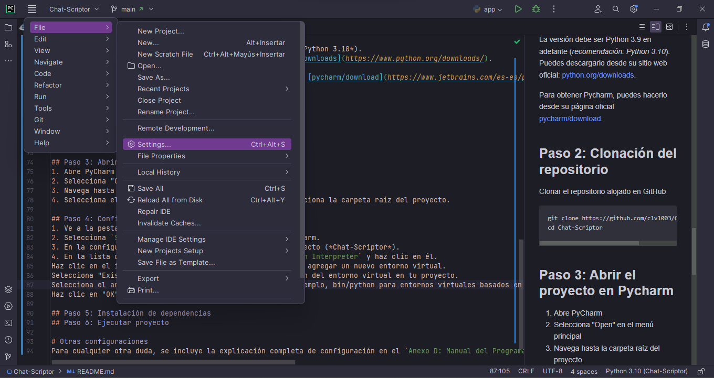
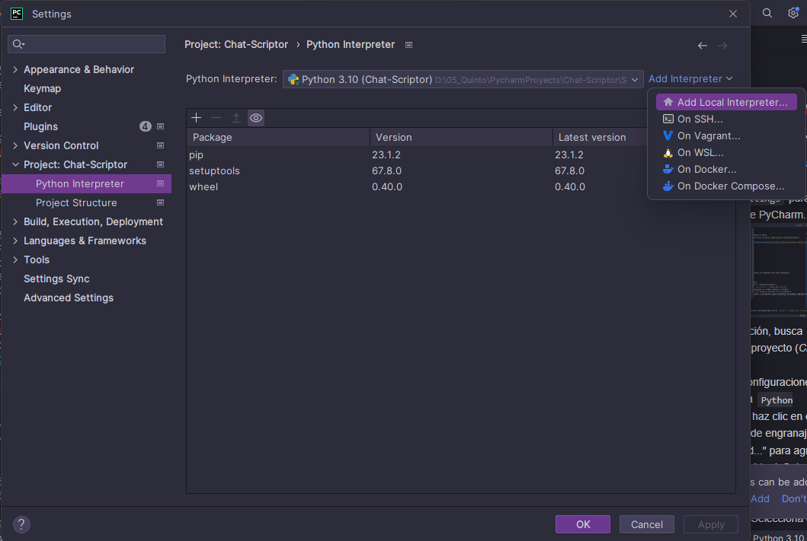
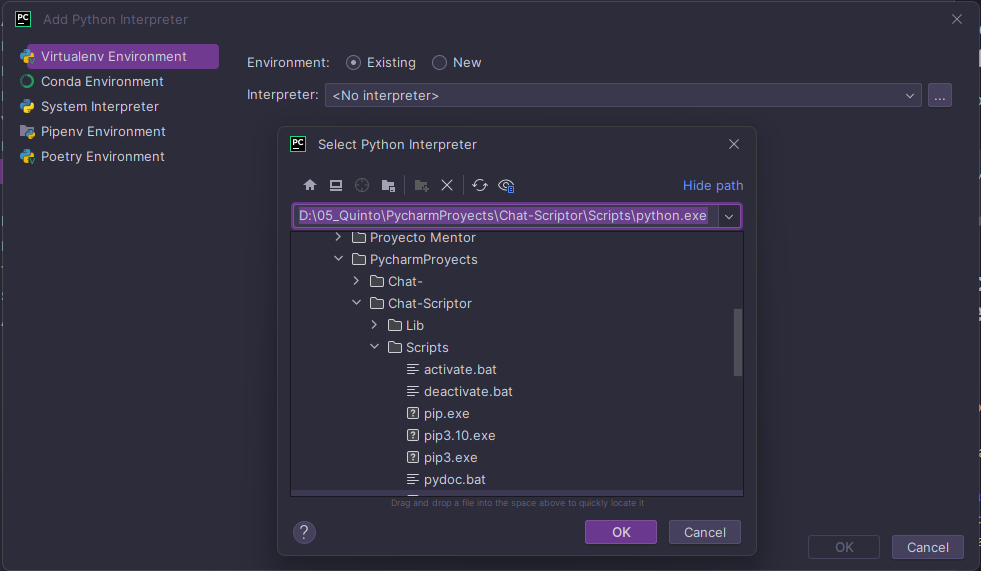
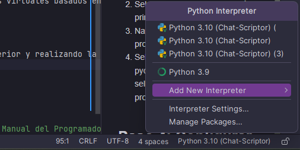
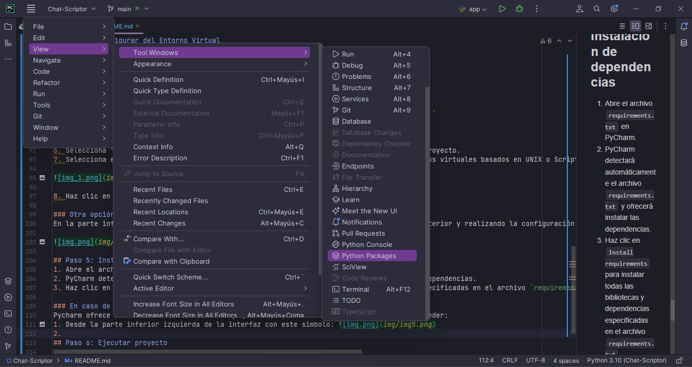
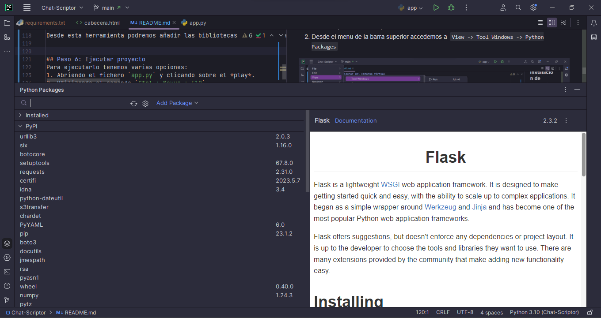
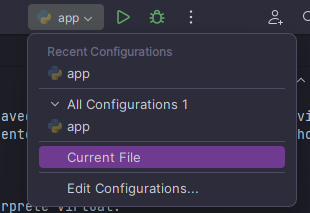

Interfaz gráfica para la gestión de chatbots en la plataforma DialogFlow

-------------------------------

# Configuración del Entorno Virtual
Este proyecto utiliza un entorno virtual de Python para gestionar las dependencias y bibliotecas necesarias.
Sigue los siguientes pasos para configurarlo en tu máquina:

## Paso 1: Instalar Python
Es obligatorio y necesario tener instalado Python en tu máquina. Puedes descargarlo desde su sitio web oficial: [python.org/downloads](https://www.python.org/downloads/).

La versión debe ser Python 3.9 en adelante (*recomendación: Python 3.10*)

## Paso 2: Clonación del repositorio
Clonar el repositorio alojado en GitHub
~~~
git clone https://github.com/clv1003/Chat-Scriptor
cd Chat-Scriptor
~~~

## Paso 3: Crear el entorno virtual
Como para este proyecto se usan versiones de Python 3, crearemos el entorno virtual para este caso:
~~~
python3 -m venv env
~~~

## Paso 4: Activar el entorno virtual
Activaremos el entorno anterior.

Para macOS y Linux:
~~~
source env/bin/activate
~~~

Para Windows
~~~
.\env\Scripts\activate
~~~

**Para desactivarlo:** `desactivate`

## Paso 5: Instalar las dependencias
En el proyecto se encuentra un archivo de `requiremets.txt` con las dependencias necesarias.
~~~
pip install -r requirements.txt
~~~

## Paso 6: Ejecutar proyecto
Si se han realizado todos los pasos anteriores correctamente, será posible ejecutar el proyecto.
~~~
python app.py
~~~

# Configuración del Entorno Virtual en Pycharm
Debido a que para el desarrollo del proyecto se ha usado este IDE, se añade la configuración exacta.

## Paso 1: Instalar PyCharm y Python
Para esta configuración, es necesario tener instalados tanto el IDE Pycharm (en cualquiera de sus versiones, aunque si eres alumno de la Universidad de Burgos podrás acceder a la versión Pycharm Professional)

La versión debe ser Python 3.9 en adelante (*recomendación: Python 3.10*).
Puedes descargarlo desde su sitio web oficial: [python.org/downloads](https://www.python.org/downloads/).

Para obtener Pycharm, puedes hacerlo desde su página oficial [pycharm/download](https://www.jetbrains.com/es-es/pycharm/download/).

## Paso 2: Clonación del repositorio
Clonar el repositorio alojado en GitHub
~~~
git clone https://github.com/clv1003/Chat-Scriptor
cd Chat-Scriptor
~~~

## Paso 3: Abrir el proyecto en Pycharm
1. Abre PyCharm 
2. Selecciona "Open" en el menú principal
3. Navega hasta la carpeta raíz del proyecto 
4. Selecciona el archivo pycharm.project o simplemente selecciona la carpeta raíz del proyecto.

## Paso 4: Configurar del Entorno Virtual
1. Ve a la pestaña `File` en la barra de menú superior
2. Selecciona `Settings` para abrir la configuración de PyCharm.

3. En la configuración, busca `Project` y selecciona tu proyecto (*Chat-Scriptor*).
4. En la lista de configuraciones del proyecto, busca `Python Interpreter` y haz clic en él.
5. Selecciona `Add Interpreter` y a continuación, en el desplegable `Add Local Interpreter...`

6. Selecciona "Existing environment" y navega hasta la ubicación del entorno virtual en tu proyecto.
7. Selecciona el archivo ejecutable del entorno virtual (por ejemplo, bin/python para entornos virtuales basados en UNIX o Scripts\python.exe para entornos virtuales basados en Windows).

8. Haz clic en "OK" para agregar el intérprete virtual.

### Otra opción
En la parte inferior de la interfaz, podemos seleccionarlo accediendo rápidamente al menu anterior y realizando la configuración de la misma manera.

## Paso 5: Instalación de dependencias
1. Abre el archivo `requirements.txt` en PyCharm.
2. PyCharm detectará automáticamente el archivo `requirements.txt` y ofrecerá instalar las dependencias.
3. Haz clic en `Install requirements` para instalar todas las bibliotecas y dependencias especificadas en el archivo `requirements.txt`.

**Es importante abrir dicho archivo, ya que en él se encuentra la información necesaria para instalar Bootstrap y Bootstrap Icons.**

### En caso de no salir esta opción
Pycharm ofrece acceso a un Administrador de paquetes (`Python Packages`) al cual podemos acceder:
1. Desde la parte inferior izquierda de la interfaz con este símbolo: 
2. Desde el menu de la barra superior accedemos a `View -> Tool Windows -> Python Packages`

Desde esta herramienta podremos añadir las bibliotecas y dependencias necesarias, realizando una búsqueda de las mismas.

## Paso 6: Ejecutar proyecto
Para ejecutarlo tenemos varias opciones:
1. Abriendo el fichero `app.py` y clicando sobre el *play*.
2. Utilizando el comando `Ctrl + Mayus + F10`
3. Accediendo desde la parte superior indicandole el archivo `app.py` o abriendo dicho archivo y pulsando `Current File`

# Otras configuraciones
Para cualquier otra duda, se incluye la explicación completa de configuración en el `Anexo D: Manual del Programador` de la memoria.